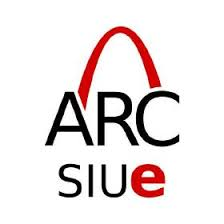

<table border="0">
  <tr>
    <td valign="center">
      
    </td>
    <td>
      <h1>NRC 2026: Micromouse Competition</h1>
      <blockquote>
        The official SIUE Autonomous Robotics Club GitHub repository for the 2026 NRC Micromouse Competition
      </blockquote>
    </td>
    <td valign="center">
      
    </td>
  </tr>
</table>


[](https://irp.cdn-website.com/9297868f/files/uploaded/NRCContestRules2026.pdf)
[](https://randomnerdtutorials.com/getting-started-with-esp32/)
[](https://www.w3schools.com/cpp/default.asp)
[](https://www.youtube.com/watch?v=dQw4w9WgXcQ)


---

## 📌 Project Overview
Our team is developing an autonomous "Mouse" to compete in the **National Robotics Challenge**. The robot must navigate a $10 \times 10$ unit square maze, mapping the environment in real-time to find the fastest path to the center.

### 📐 Competition Constraints (NRC Rules)
**Some Basics:**
* **Mouse Size:** Max $7" \times 7" \times 7"$.
* **Maze Size:** $10 \times 10$ of $10" \times 10"$ tiles.
* **Time:** 10-minute total run time.
* **Autonomy:** No external communication once the maze layout is disclosed.
* **Scoring:** Based on the fastest run + search time penalties.
* **Wall Hugging:** It is explicitly mentioned in the rules that steps will be taken to diminish this searching algorithm. 
* **Starting Place:** Mouse will always start in one of the four corners, the start square will be bounded on three sides by walls.
* **Finish Line:** Goal is to end up in the four-tile room in the middle, the destination square has only one entrance. However, multiple paths to the destination square are allowed and are to be expected.
* **Winner Winner Chicken Dinner:** The minimum run time shall be the robot's official time (Dash Attempt). 

<p align="center">
  
</p> 

> *Example maze provided in 2026 NRC Contest Manual.*
---

## 📂 Repository Structure

| Icon | Folder | Purpose |
| :--- | :--- | :--- |
| 🧠 | [`/algorithms`](./algorithms) | Maze-solving logic (Flood Fill, DFS). |
| 🔌 | [`/firmware`](./firmware) | ESP32 source code & PID control. |
| 🏗️ | [`/hardware`](./hardware) | CAD & PCB Schematics. |
| 📊 | [`/simulations`](./simulations) | Logic testing environments. |
| 📋 | [`/doc`](./doc) | NRC Rules & Engineering Notebook. |
| 🪟 | **[OneDrive Hub]** | [**Click here for OneDrive**](https://siuecougars-my.sharepoint.com/:f:/r/personal/ngarmon_siue_edu/Documents/ARC/Micro%20Mouse?csf=1&web=1&e=Olx0Ui) |

---

## 🛠️ Tech Stack
* **Microcontroller:** ESP32.
* **Sensors:** To Be Determined.
* **Actuators:** To Be Determined.
* **Design:** Custom 3D printed chassis.

---

## 🧠 Navigation Progress
We are currently iterating on two main logic paths:

-  **Flood Fill:** - Works by "pouring water" from the goal to the start, assigning distance values to cells. The mouse then moves toward lower-value cells, effectively calculating the shortest path. ([**Video explanation**](https://www.youtube.com/watch?v=ktn3C7aXVR0))
-  **Depth Search:** - Explores as far as possible along each branch before backtracking. It is "blind" to the shortest path until it has explored all options.

---

## 🏁 Development Setup

<details>
<summary><b>Click to expand: Software Installation</b></summary>

1. **Install VS Code**
2. **Install PlatformIO Extension** (for ESP32 development).
3. **Clone the Repo:**
   ```bash 
   git clone [https://github.com/](https://github.com/)[your-username]/[your-repo-name].git
</ul>
</details>

---

## 📈 Recent Progress

<table border="0">
  <tr>
    <td width="50%" align="center">
      
    </td>
    <td width="50%" align="center">
      
      </img>
    </td>
  </tr>
  <tr>
    <td align="center">
      <i>Visualization of the <b>Flood Fill Algorithm</b> mapping the 10x10 maze.</i>
    </td>
    <td align="center">
      <i>Mouse running the course with <b>preliminary navigation logic</b>.</i>
    </td>
  </tr>
</table>

 > *Maze provided is also a work in progress.*
---
