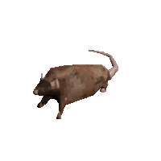
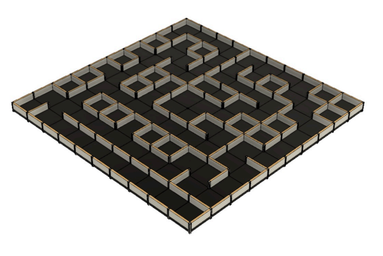
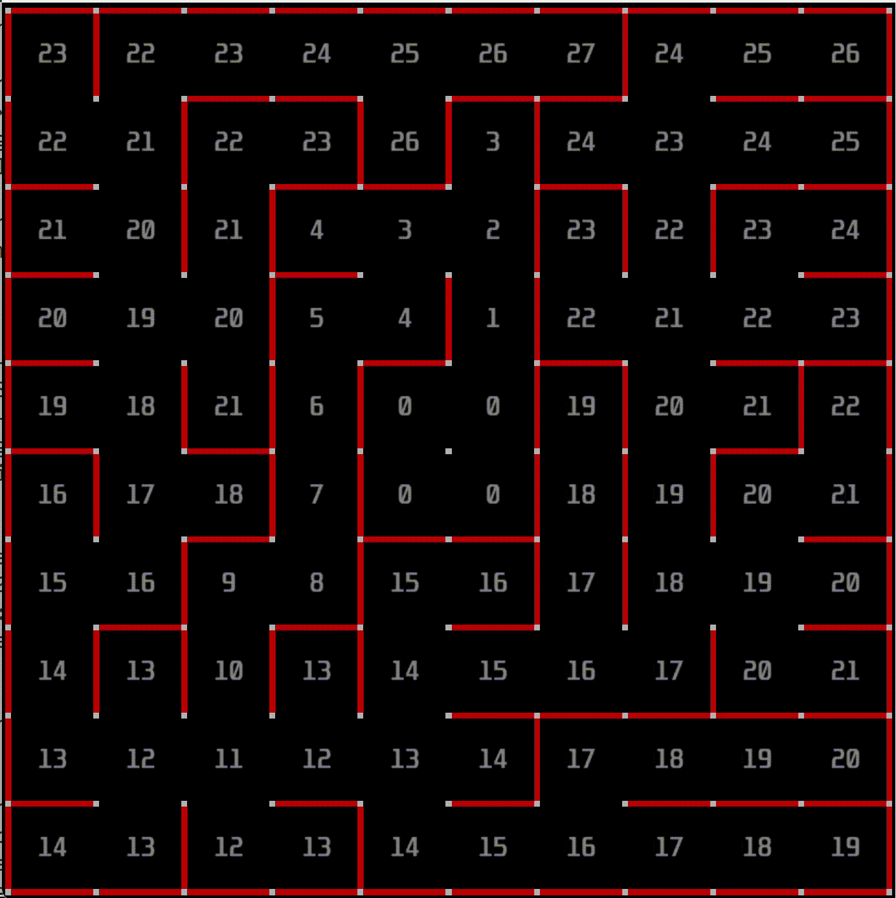

<table border="0">
  <tr>
    <td valign="center">
      
    </td>
    <td>
      <h1>NRC 2026: Micromouse Competition</h1>
      <blockquote>
        The official SIUE Autonomous Robotics Club GitHub repository for the 2026 NRC Micromouse Competition
      </blockquote>
    </td>
    <td valign="center">
      
    </td>
  </tr>
</table>


[](https://irp.cdn-website.com/9297868f/files/uploaded/NRCContestRules2026.pdf)
[](https://randomnerdtutorials.com/getting-started-with-esp32/)
[](https://www.w3schools.com/cpp/default.asp)
[](https://www.youtube.com/watch?v=dQw4w9WgXcQ)


---

## Project Overview
Our team is developing an autonomous "Mouse" to compete in the **National Robotics Challenge**. The robot must navigate a $10 \times 10$ unit square maze, mapping the environment in real-time to find the fastest path to the center.

### Competition Constraints (NRC Rules)
**Some Basics:**
* **Mouse Size:** Max $7" \times 7" \times 7"$.
* **Maze Size:** $10 \times 10$ of $10" \times 10"$ tiles.
* **Time:** 10-minute total run time.
* **Autonomy:** No external communication once the maze layout is disclosed.
* **Scoring:** Based on a factor of things but overall shortest time wins.

<details>
<summary><b>Click for more extensive rules</b></summary>


**Maze Criteria:**
* No inaccessible locations
* Mouse will always start in one of the four corners 
* Exactly three starting walls
* Only one entrance to the center, multiple paths to the destination square are allowed and are to be expected
* Has a hollow center, i.e. the center peg has no walls attached to it
* Has walls attached to every peg except the center peg
* Is unsolvable by a wall-following robot 

**Time Criteria:**
* The run timer will start when the front edge of the robot crosses the start line and stops when
the front edge of the robot crosses the finish line
* If a robot re-enters the start square before entering the destination square on a run that run is aborted and a new run will begin with a new time that starts when the starting square is exited.
* The robot may, after reaching the destination square, continue to navigate the maze for as long
as their total maze time allows. The time taken will not count toward any run.
* If an operator touches the robot during a run, it is
deemed aborted, and the robot must be removed from the maze.
* If a robot has already crossed the finish line, it may be removed at any time without affecting the
run time of that run
* The minimum run time shall be the robot's official time (Dash Attempt).

**Scoring Criteria:**
* Robots that do not enter the center square will be ranked by the maximum number of cells they
consecutively transverse without being touched. However, judges are not required to give any
rankings to robots who do not finish and may declare no winners or declare less than three
winners at their discretion.

**Alteration Criteria:**
* After the maze is disclosed, the operator shall not feed information on the maze into the robot.
However, switch positions may be changed for the purpose of changing programs within the
robot (changing algorithms is allowed)
* A contestant may not alter a robot in a manner that alters its weight
* contestants are allowed to: Change switch settings (e.g., to change algorithms), replace batteries between runs, adjust sensors, change speed settings, make repairs 

</ul>
</details>
 

<p align="center">
  
</p> 

> *Example maze provided in 2026 NRC Contest Manual.*
---

## Repository Structure

| Folder | Purpose |
| :--- | :--- |
| [`/Past Firmware`](./Past%20Firmware) | ESP32 source code, kept for reference when an ESP32-based design is revisited. |
| [`/Hardware`](./Hardware) | Schematics for all current components and STP print files for the robot chassis. |
| [`/Simulations`](./Simulations) | Flood Fill logic and supporting files for simulating maze navigation. |
| [`/Romi32u4`](./Romi32u4) | Code for the current Romi 32U4-based platform. |
| **[OneDrive Hub]** | [**Click here for OneDrive**](https://siuecougars-my.sharepoint.com/:f:/r/personal/ngarmon_siue_edu/Documents/ARC/Micro%20Mouse?csf=1&web=1&e=Olx0Ui) |

---

## Tech Stack
> *Current iteration uses a Romi 32U4 + Raspberry Pi combination.*

* **Primary Controller:** [Romi 32U4 Control Board](https://www.pololu.com/docs/0J69/all) — handles low-level motor control, encoder feedback, and sensor interfacing.
* **Companion Computer:** Raspberry Pi — runs higher-level navigation logic and communicates with the Romi over serial.
* **Platform:** [Romi Chassis & Motor Kit](https://www.pololu.com/product/3544) — motors, encoders, and drivetrain are integrated into the Romi platform.
* **Sensors:** Wall detection uses a mix of sensor types:
  * *Left & Right:* GP2Y0A41YK0F Sharp IR Analog Distance Sensors.
  * *Front:* Generic digital IR obstacle avoidance sensor.
* **Actuators & Design:** Built into the Romi platform (dual DC motors with encoders, integrated motor driver).

---

## Navigation Process
The mouse uses **Flood Fill** as its core algorithm — a form of Breadth-First Searching that works by "pouring water" from the goal back to the start, assigning distance values to each cell. The mouse always moves toward lower-value cells, driving it toward the goal. ([**Video explanation**](https://www.youtube.com/watch?v=ktn3C7aXVR0))

Maze solving is broken into three sequential phases:

1. **Search Phase:** The mouse explores the maze from the starting corner, continuously updating its internal map as new walls are discovered. Flood Fill is recalculated after each new wall is detected, always routing the mouse toward the goal via the best known path.
2. **Return Phase:** Once the goal is reached, the mouse navigates back to the starting position using the map it has built, again guided by Flood Fill.
3. **Goal Run:** With a complete map in hand, the mouse executes a final optimized run from start to goal, following the shortest path determined during the search phase.

<table border="0">
  <tr>
    <td width="50%" align="center">
      
      </img>
    </td>
  </tr>
  <tr>
    <td align="center">
      <i>Visualization of the <b>Flood Fill Algorithm</b> mapping the 10x10 maze.</i>
    </td>
  </tr>
</table>

---

## Development Setup

<details>
<summary><b>Click to expand: Software Installation</b></summary>

1. **Install VS Code**
2. **Install PlatformIO Extension** (for ESP32 development).
3. **Clone the Repo:**
   ```bash 
   git clone [https://github.com/](https://github.com/)[your-username]/[your-repo-name].git
</ul>
</details>

